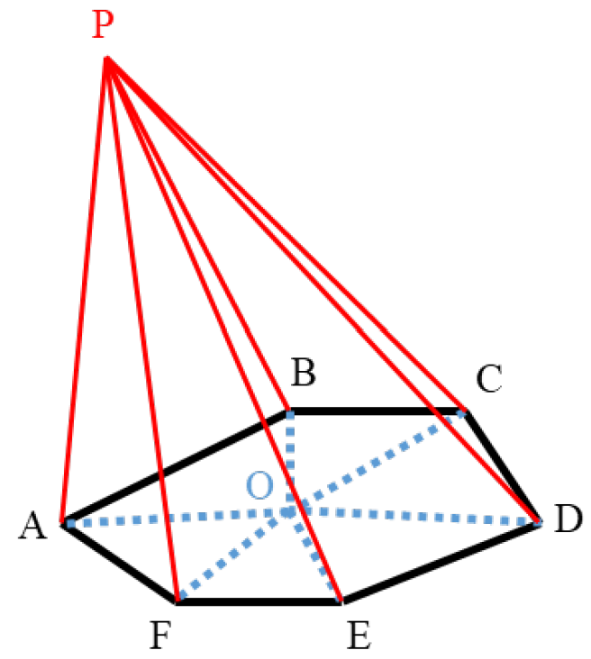
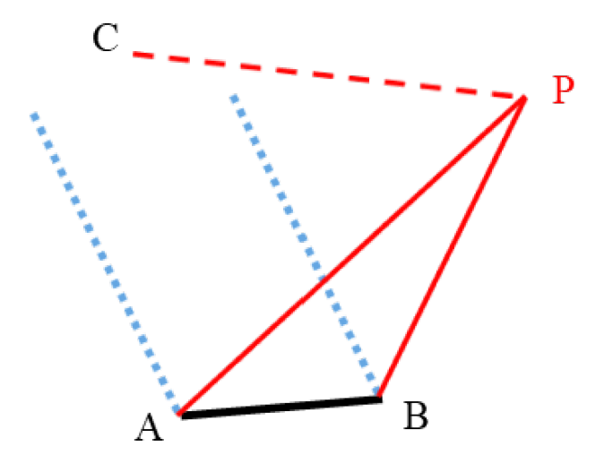
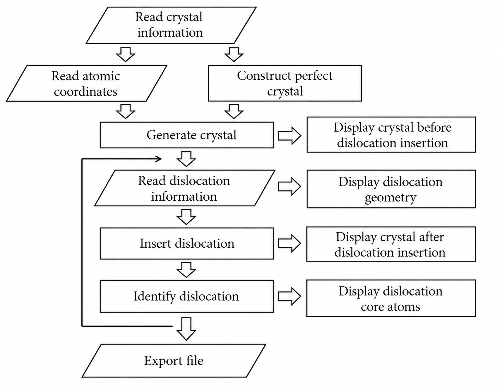

# AtomDisloGen: Atomistic Dislocation Generator

AtomDisloGen is a C++ research code for constructing dislocation-containing atomic configurations for atomistic simulations. The code implements an atomistic version of the Volterra dislocation construction procedure: a discontinuous displacement field is applied across a chosen cut surface, and the point defects generated on the cut surface are subsequently removed by adding or deleting atoms.

The program is intended for materials simulation researchers who need initial atomic configurations containing dislocation loops or curved dislocation lines with user-defined Burgers vectors and geometries.

This repository should be regarded as an early research-code release rather than a polished software package. The present implementation was developed for specific atomistic-simulation workflows and may require adaptation before use in other systems, boundary conditions, input/output formats, or larger-scale applications. Users are encouraged to inspect the algorithm carefully and modify the code for their own research purposes. Please note that this repository is provided as an open research-code release, and active maintenance is not guaranteed.

> **AI-assisted documentation notice**  
> This README was translated and reorganized from the original Chinese technical notes with assistance from ChatGPT. The code and scientific method should be checked by the maintainers before release.

## Citation

If you use this code or a modified version of it, please cite:

> Jin-Yu Zhang and Wen-Zheng Zhang, *Modelling and Simulation in Materials Science and Engineering* **27**, 035008 (2019).

## License

This project is released under the MIT License. You are free to use, copy, modify, merge, publish, distribute, sublicense, and/or sell copies of the software, provided that the copyright notice and license text are retained.

## Scope and supported systems

The current code supports:

- Simple cubic (SC), body-centered cubic (BCC), and face-centered cubic (FCC) crystals.
- Full dislocations in SC, BCC, and FCC crystals.
- FCC partial dislocations, including Shockley and Frank partial dislocations.
- Several convenient dislocation-line geometries:
  - rectangle,
  - regular polygon,
  - circle,
  - ellipse,
  - helix,
  - user-defined polyline / irregular polygon.

The output is written as a LAMMPS-style `data` file containing atom IDs, atom types, and Cartesian coordinates.

### Planar dislocation loops

For planar dislocation loops such as circles, ellipses, rectangles, and regular polygons, the cut surface is chosen as the planar area enclosed by the loop. After the loop is discretized into line segments, the code uses the loop centroid as a reference point and decomposes the enclosed polygon into triangles.

<p align="center">
  
</p>

<p align="center"><em>Figure 1. Triangulation used for planar dislocation loops.</em></p>

### General curved dislocation lines

For a general three-dimensional curved dislocation line, the user provides a polyline representation of the dislocation. The cut surface is defined by the polyline and a trace direction vector. If the trace direction is parallel to the Burgers vector, the cut surface corresponds to the glide surface. In the implementation, each dislocation segment uses a semi-infinite strip-like cut surface for the solid-angle calculation.

<p align="center">
  
</p>

<p align="center"><em>Figure 2. Solid-angle construction for a general curved dislocation segment.</em></p>

## Program workflow

The workflow consists of reading or generating a crystal, defining one or more dislocations, inserting them into the crystal, and exporting the final structure.

<p align="center">
  
</p>

<p align="center"><em>Figure 3. General workflow of the dislocation-construction program.</em></p>

Note: The workflow diagram includes optional visualization and dislocation-identification steps from the original technical design. In the current default source file, the Nye-tensor-based identification routine is commented out, and visualization-related output is only a placeholder. The default executable focuses on crystal generation/import, dislocation insertion, and structural output.

## Important data structures

### `lattice`

The `lattice` structure stores the crystal and simulation-cell information.

| Field | Meaning |
| --- | --- |
| `lattice_para` | Cubic lattice parameter. |
| `lattice_type` | Crystal structure: `sc`, `bcc`, or `fcc`. |
| `sizebox` | Lower and upper bounds of the orthogonal simulation box. |
| `Mb2o` | Orientation matrix between the crystal and box coordinate systems. |
| `bbcc_num` | Number of neighbor vectors used for the Wigner-Seitz construction. |
| `bre` | Reciprocal vectors associated with the Wigner-Seitz cell. |
| `atomnum` | Number of atoms. |
| `points_type` | Atom type array. |
| `pointsb` | Cartesian coordinates of atoms in the box coordinate system. |

The global variable `lat` stores the crystal before and after dislocation insertion. The global variable `lat_disl` is reserved for storing atoms identified as belonging to dislocation cores.

### `dislocation`

The `dislocation` structure stores the geometry and Burgers vector of a dislocation line.

| Field | Meaning |
| --- | --- |
| `type` | Type of dislocation-line geometry. |
| `numP` | Number of vertices used to discretize the dislocation line. |
| `b` | Burgers vector, given in crystal coordinates. |
| `Points` | Coordinates of dislocation-line vertices in the box coordinate system. |
| `trace_of_cut` | Trace direction of the cut surface for general curved lines. |

## Main functions

| Function | Purpose |
| --- | --- |
| `dot()` | Dot product of two 3D vectors. |
| `cross()` | Cross product of two 3D vectors. |
| `norm()` | Norm of a 3D vector. |
| `orthogonalization()` | Checks and orthogonalizes two nearly orthogonal directions. |
| `solidangle_tri()` | Calculates the solid angle of a triangular surface element. |
| `print_vector()` | Prints a vector for testing/debugging. |
| `print_matrix()` | Prints an `N x 3` matrix for testing/debugging. |
| `output_for_test()` | Writes atom coordinates, atom types, and one atom property for testing. |
| `init_lat()` | Initializes the global `lat` structure from user inputs. |
| `import_lattice()` | Imports a simple LAMMPS data file and initializes `lat`. |
| `create_lattice()` | Generates a perfect SC/BCC/FCC crystal. |
| `polygon()` | Helper used by ellipse and regular-polygon constructors. |
| `create_ellipse()` | Creates an elliptical dislocation loop. |
| `create_circle()` | Creates a circular dislocation loop. |
| `create_polygon()` | Creates a regular polygonal dislocation loop. |
| `create_rectangle()` | Creates a rectangular dislocation loop. |
| `create_helix()` | Creates a helical dislocation line. |
| `create_pointlist()` | Creates a user-defined dislocation from a list of vertices. |
| `construct_dislocations()` | Inserts a dislocation into the crystal stored in `lat`. |
| `output()` | Exports a lattice structure as a LAMMPS-style data file. |
| `visualization()` | Placeholder routine for visualization output. |
| `identify_disl()` | Commented legacy routine intended for Nye-tensor-based dislocation-core identification; not compiled in the default release. |

## Implementation notes for selected routines

The table above gives a compact list of the routines. The following notes summarize the main implementation details that are most relevant when modifying the code.

### `import_lattice()`

`import_lattice()` initializes the global `lat` structure from user-supplied crystal information and a simple LAMMPS-style data file. It first calls `init_lat()` to set the lattice parameter, lattice type, simulation-box bounds, and box orientation. It then defines the Wigner-Seitz-cell reciprocal vectors used later for atom-overlap checking.

The current importer is intentionally simple. It searches the input file for the number of atoms, the orthogonal box bounds (`xlo xhi`, `ylo yhi`, and `zlo zhi`), and the `Atoms` section. Lines starting with `#` are treated as comments. In the `Atoms` section, each atom line is assumed to contain at least the atom ID, atom type, and three Cartesian coordinates. The current routine imports the coordinates into `lat.pointsb`; atom-type information from the input file is not used as a general multi-species data model. Triclinic box tilt factors are not handled in the default implementation.

### `create_lattice()`

`create_lattice()` generates a perfect SC, BCC, or FCC crystal according to the lattice parameter, box bounds, and orientation vectors. After initializing `lat`, the routine selects the corresponding basis and neighbor vectors, constructs the Wigner-Seitz-cell reciprocal vectors, and transforms them into the simulation-box coordinate system.

To make sure the generated crystal covers the target simulation box after rotation, the code first maps the eight simulation-box corners into crystal coordinates and determines the necessary integer lattice-index range. It then generates all candidate atoms in this expanded range and removes atoms outside the retained box. A margin of several lattice spacings is kept during generation so that subsequent dislocation insertion does not immediately create artificial surface steps at the nominal box boundary.

### Dislocation-geometry constructors

The routines `create_rectangle()`, `create_polygon()`, `create_circle()`, `create_ellipse()`, `create_helix()`, and `create_pointlist()` convert user-specified geometric parameters into a common `dislocation` structure. The Burgers vector is stored in crystal coordinates, whereas the dislocation-line vertices are stored in the simulation-box coordinate system.

For planar loops, such as rectangles, regular polygons, circles, and ellipses, the cut surface is implicitly taken as the planar area enclosed by the loop. For helices and user-defined polylines, the cut surface is instead defined using the line segments and `trace_of_cut`, corresponding to a semi-infinite strip-like construction for each segment.

### `construct_dislocations()`

`construct_dislocations()` is the central routine that modifies the atomic structure stored in `lat`. It first converts the Burgers vector from crystal coordinates into the simulation-box coordinate system. For FCC partial dislocations, the code includes special handling for Burgers vectors close to Shockley or Frank partials.

The routine then calculates the solid angle subtended by the cut surface at every atom. The discontinuous displacement field is applied according to the solid angle. Neighboring atoms with a large solid-angle jump are classified as atoms lying across the cut surface. These atoms are used to determine where vacancies or self-interstitials have been generated by the displacement discontinuity.

Vacancies near the cut surface are filled by duplicating atoms on one side of the cut surface and translating the duplicates by the Burgers vector. Self-interstitial atoms are then removed using a Wigner-Seitz-cell criterion based on the reciprocal vectors stored in `lat.bre`. For efficiency, neighbor searches are performed with a simple spatial binning method rather than all-pairs distance checks. The routine finally updates `lat.atomnum`, `lat.pointsb`, and `lat.points_type`.

### `identify_disl()` legacy routine

The original technical notes describe a Nye-tensor-based dislocation-identification routine. In the current source file, this routine and the LAPACKE headers are commented out, so `identify_disl()` is not part of the default compiled executable. It should therefore be treated as legacy or experimental code.

The intended workflow of this commented routine is to build a neighbor list, match actual neighbor vectors to reference crystal vectors, solve for the local deformation matrix by least squares, calculate the Nye tensor from spatial gradients of the deformation matrix, and use singular-value decomposition to identify atoms belonging to dislocation cores and estimate their local Burgers-vector character. Re-enabling this routine would require restoring the LAPACKE includes, linking against appropriate LAPACK/BLAS libraries, and validating the numerical tolerances for the target crystal and defect structure.

## Input conventions

### Crystal input

| Parameter | Meaning | Unit / type | Valid values |
| --- | --- | --- | --- |
| `lattice_type` | Crystal structure | `char[]` | `sc`, `bcc`, `fcc` |
| `xdir` | Box `x` direction in crystal coordinates | `double[3]` | Must be orthogonal to `zdir` |
| `zdir` | Box `z` direction in crystal coordinates | `double[3]` | Must be orthogonal to `xdir` |
| `sizebox` | Lower and upper bounds of the simulation box | Angstrom, `double[3][2]` | Upper bound must exceed lower bound for each direction |
| `lattice_para` | Cubic lattice parameter | Angstrom, `double` | `> 0` |
| `import_lattice()` | Import an existing structure | LAMMPS data file | Orthogonal box only |
| `create_lattice()` | Generate a perfect crystal | - | Uses the parameters above |

### Dislocation input

The Burgers vector is given in crystal coordinates. Geometric coordinates and lengths are given in the simulation-box coordinate system.

| Geometry | Main input parameters |
| --- | --- |
| Rectangle | Center, two orthogonal in-plane directions, two half-lengths, Burgers vector. |
| Regular polygon | Center, normal direction, one edge direction, edge length, number of edges, Burgers vector. |
| Circle | Center, loop normal, radius, Burgers vector. |
| Ellipse | Center, major/minor axis directions, semi-axis lengths, Burgers vector. |
| Helix | Center, helical axis direction, start direction, radius, pitch, number of turns, Burgers vector. |
| Point list / irregular polygon | Ordered list of vertices, Burgers vector, and optional cut-trace direction. |

## Building

A C++11 compiler is sufficient for the current default build.

```bash
g++ -std=c++11 -O2 construct_dislocations2.cpp -o construct_dislocations2
```

No external library is required for the default build. The Nye-tensor-based identification routine is commented out in the current source file. If this legacy routine is re-enabled, LAPACKE or equivalent linear-algebra support must be restored and linked explicitly.

## Running

Edit the parameters in `main()` to define the crystal, box orientation, dislocation type, Burgers vector, and dislocation geometry. Then run:

```bash
./construct_dislocations2
```

The default output file name is:

```text
dislocations_atom_initial.txt
```

This file can be used as a LAMMPS-style initial atomic configuration after checking that the generated structure matches the intended geometry and boundary conditions.

## Notes and limitations

- The code currently assumes an orthogonal simulation box for import and output.
- The lattice type should be one of `sc`, `bcc`, or `fcc`.
- The two orientation vectors supplied to the lattice initialization should be nearly orthogonal. If they deviate too strongly from orthogonality, the code exits with an error.
- For partial dislocations, the cut surface should not pass exactly through an atomic plane, otherwise unintended defects may appear around the stacking fault.
- If the cut surface intersects another dislocation line or intersects the same dislocation line again, jogs may be generated. This may or may not be desired.
- For general 3D curved dislocation lines, the semi-infinite cut surface can affect other dislocations if several dislocations are inserted sequentially. The geometry should therefore be checked carefully.
- The generated structures should normally be relaxed by energy minimization or molecular dynamics before production simulations.
- The Nye-tensor-based `identify_disl()` routine is currently commented out and should not be considered an active feature of the default release.

## Suggested repository layout

```text
.
├── README.md
├── LICENSE
├── construct_dislocations2.cpp
└── assets/
    ├── figure-1-planar-loop-solid-angle.png
    ├── figure-2-curved-line-solid-angle.png
    └── figure-3-software-workflow.png
```
